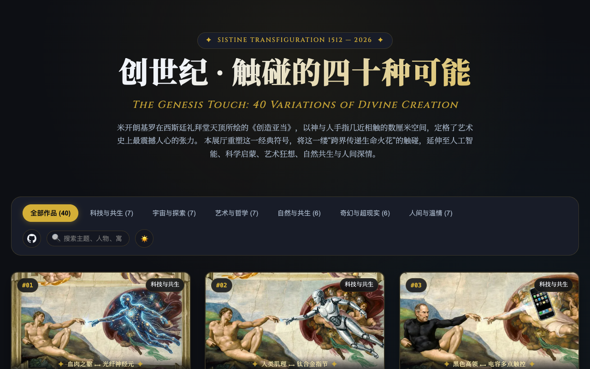

# 创世纪 · 触碰的四十种可能 / The Genesis Touch

致敬米开朗基罗《创造亚当》经典构图，探索科技、宇宙、哲学、艺术、自然与人间温情中，生命与造物指尖相触的40种终极隐喻。已完成三层渐进图片加载优化，提供沉浸式名画变种数字展厅体验。

An interactive digital art exhibition paying homage to Michelangelo's The Creation of Adam, exploring 40 variations of divine touch across technology, cosmos, philosophy, art, nature, and human affection. Built with progressive multi-tier image loading and dual museum theme aesthetics.



## 在线体验 / Live Demo

- [Cloudflare Demo](https://the-creation-variants.xiaosang.cc/)
- [GitHub Repo](https://github.com/holynova/the-creation-variants)


## 特性 / Features

- **三层渐进式图片架构**：列表 600px WebP 缩略图、灯箱 1376px 高清 WebP 无感平滑解码、原图独立归档下载，首屏资源体积减少 94%。
- **文艺复兴与现代展厅美学**：西斯廷壁画肌理结合暗黑与古典羊皮纸双主题切换。
- **多维分类与实时检索**：涵盖科技、宇宙、哲学、自然、奇幻、人间 6 大主题，支持全字段瞬时中英文搜索。

## 本地运行 / Run locally

```bash
python3 -m http.server 8000
# 浏览器访问 http://localhost:8000
```

## 发布 / Deploy

```bash
npx wrangler deploy --config wrangler.jsonc
```

Cloudflare Workers · Custom Domain: `the-creation-variants.xiaosang.cc`

源码与部署配置使用同一个主分支；在本地手动发布，不创建 Cloudflare 专用分支或 GitHub Action。
