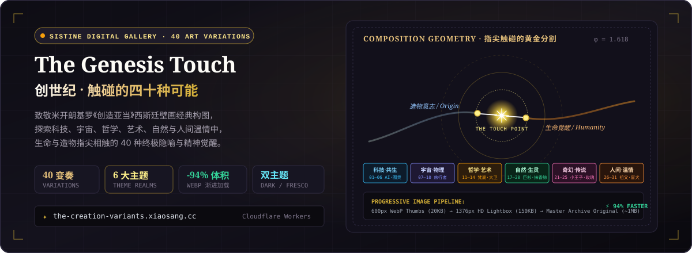

<p align="center">
  
</p>

<p align="center">
  <a href="https://the-creation-variants.xiaosang.cc/"></a>
  <a href="#-全景展厅名画变种总览-exhibition-catalog"></a>
  <a href="#-三层渐进式图片架构与性能工程"></a>
  <a href="#-技术栈与零依赖纯粹设计"></a>
  <a href="./LICENSE"></a>
</p>

---

## 🎨 策展立意与艺术概念 (Curatorial Premise)

公元 1511 年，米开朗基罗在梵蒂冈西斯廷礼拜堂天顶画下了人类艺术史上最震撼人心的瞬间之一——《创造亚当》（*The Creation of Adam*）。上帝伸出充满神力与造物意志的手指，亚当伸出渴望苏醒与灵魂注入的指尖，两者在天地之间微隙相迎，定格了“生命诞生与精神觉醒”的永恒隐喻。

**《创世纪 · 触碰的四十种可能》（The Genesis Touch）** 是一座沉浸式数字艺术展厅。我们致敬并解构这一经典构图，将那道穿越时空的指尖相触，延伸至人类文明所能触及的 **6 大宏大主题 realm**：

- **科技与共生**：从碳基指尖与硅基光纤的交汇，到乔布斯触碰 iPhone 玻璃与极客在子夜触碰跳动的终端光标；
- **宇宙与物理**：从宇航员伸向外星异种，到旅行者一号回眸暗淡蓝点与天文学家逼近黑洞事件视界；
- **哲学与艺术**：从米开朗基罗雕琢大卫的凿痕，到梵高燃烧的向日葵与敦煌画工点染的九色鹿触角；
- **自然与生灵**：从自由潜水员轻触深海座头鲸鳍尖，到巡护员守候最后一头白犀牛的苍老吻部；
- **奇幻与传说**：从小王子隔着玻璃轻抚带刺的玫瑰，到时间旅行者逆流光阴轻叩年轻的自己；
- **人间与温情**：从祖父长满老茧的手握住初生婴儿的小拳头，到盲人在黑暗中触及导盲犬湿润的鼻尖。

在这 40 个变奏中，每一次触碰都不仅是构图的致敬，更是生命在虚无与崇高之间对存在意义的凝视。

---

## 🌐 在线展厅与体验入口 (Live Demos)

| 展厅入口 | 访问地址 | 体验说明 |
| :--- | :--- | :--- |
| 🏛 **Cloudflare 全球直连展厅** | [the-creation-variants.xiaosang.cc](https://the-creation-variants.xiaosang.cc/) | 官方推荐，全球边缘加速，毫秒级极速首屏 |
| 💻 **GitHub 开源仓库** | [github.com/holynova/the-creation-variants](https://github.com/holynova/the-creation-variants) | 完整展品元数据、高质量图片分层资产与纯原生源码 |

### 📱 手机扫码观展
拿起手机扫描下方二维码，即刻步入西斯廷数字画廊，体验沉浸式滑动与高清灯箱鉴赏：

<p align="center">
  
</p>

---

## 🖼 展厅实景与交互体验 (Gallery Showcase)

<p align="center">
  
</p>

- **双美术馆主题沉浸切换**：
  - **Sistine Dark（西斯廷暗夜）**：深邃的玄黑底色与古典金铜光芒，再现暗室观画的庄严肃穆；
  - **Fresco Parchment（壁画羊皮纸）**：温润如米开朗基罗手稿的古典象牙白与矿物灰，还原文艺复兴湿壁画的粗砺触感。
- **瞬时多维检索与过滤**：支持 6 大主题快速筛选，实时检索标题、触碰主体、象征隐喻与铭刻名言。
- **沉浸式高清灯箱 (Lightbox)**：双击展开高清细节，独立展示触碰微距、艺术解读与原图归档下载通道。

---

## 🏛 全景展厅名画变种总览 (Exhibition Catalog)

### 一、科技重构与人机共生 (Tech & Symbiosis)
| 编号 | 作品名称 (Title) | 触碰主体 (Touch Subject) | 核心象征与哲学隐喻 |
| :---: | :--- | :--- | :--- |
| **01** | 人类与人工智能 | 血肉之躯 ⟷ 光纤神经元 | 碳基生命与硅基智能的觉醒碰撞，重塑造物的幻影 |
| **02** | 人类与机械人 | 人类肌理 ⟷ 钛合金指节 | 向阿西莫夫与赛博黄金时代致敬，机械心跳的第一道电弧 |
| **03** | 史蒂夫·乔布斯与初代 iPhone | 黑色高领 ⟷ 电容多点触控 | 2007 莫斯康中心，指尖电容改变全人类连接物理世界的方式 |
| **04** | 程序员与绿色光标 | 疲惫极客 ⟷ 终端光标矩阵 | 深夜子夜写字楼中，跳动的绿色终端光标抚平极客的孤寂 |
| **05** | 极客与开源企鹅 | 开源先驱 ⟷ Tux 企鹅翼尖 | 跨越商业垄断藩篱，自由与开源精神平权传递的火种 |
| **06** | 图灵与咬过的苹果 | 密码破译者 ⟷ 氰化物毒苹果 | 现代计算机之父的苦难受难日与献祭智慧的无声救赎 |

### 二、宇宙浩瀚与物理真理 (Cosmos & Physics)
| 编号 | 作品名称 (Title) | 触碰主体 (Touch Subject) | 核心象征与哲学隐喻 |
| :---: | :--- | :--- | :--- |
| **07** | 宇航员与地外文明 | 舱外宇航服 ⟷ 发光异星指尖 | 费米悖论的终极破解，不同星际演化维度的第一次善意凝视 |
| **08** | 牛顿与万有引力苹果 | 沉思学者 ⟷ 坠落的重力之源 | 经典力学破晓之光，宇宙隐秘秩序在草地上对凡人的轻叩 |
| **09** | 旅行者一号与暗淡蓝点 | 深空镀金唱片 ⟷ 悬浮母星微尘 | 飞出日球层顶的人类信使，回望深空悬浮尘埃上的全部悲欢 |
| **10** | 天文学家与黑洞视界 | 射电望远镜 ⟷ 弯曲光锥奇点 | 广义相对论的时空尽头，不可逆物理定律与求知热望的对峙 |
| **34** | 居里夫人与幽绿镭光 | 灼伤指尖 ⟷ 放射性荧光微粒 | 科学殉道者的坚毅双手，从沥青铀矿中提炼出的诺贝尔幽芒 |
| **40** | 星际拓荒者与戴森球 | 拓荒宇航手 ⟷ 恒星工程巨构 | 卡尔达肖夫 II 型文明巅峰，人类工业意志环抱恒星的终极冠冕 |

### 三、哲学深思与艺术璀璨 (Philosophy & Art)
| 编号 | 作品名称 (Title) | 触碰主体 (Touch Subject) | 核心象征与哲学隐喻 |
| :---: | :--- | :--- | :--- |
| **11** | 生物学家与双螺旋 DNA | 显微透镜 ⟷ 碱基对旋转阶梯 | 38 亿年生命演化暗语，解开四种碱基编织的造物天书 |
| **12** | 米开朗基罗与大卫像 | 雕刻凿刀 ⟷ 呼吸的大理石肌肉 | 释放禁锢在大理石中的完美灵魂，艺术家的造神时刻 |
| **13** | 梵高与向日葵 | 旋转厚重油彩 ⟷ 燃烧的金色花盘 | 阿尔勒炽热太阳下的癫狂与纯真，用燃烧的灵魂涂抹画布 |
| **14** | 哲学家与柏拉图洞穴真理 | 挣脱锁链者 ⟷ 洞外刺目烈日 | 走出投影幻象的认知飞跃，哲学启蒙必然承受的刺眼阵痛 |
| **32** | 敦煌画工与九色鹿 | 矿物石青笔触 ⟷ 佛国灵鹿触角 | 莫高窟千年风沙深处，无名画工指尖流淌的盛唐慈悲与空灵 |
| **35** | 贝多芬与命运缪斯 | 失聪琴键敲击 ⟷ 永恒欢颂交响 | 扼住命运咽喉的狂风骤雨，在无声世界奏响给全人类的颂歌 |
| **38** | 钟表匠与时间之神柯罗诺斯 | 游丝摆轮 ⟷ 飞逝流淌之河 | 精密机械对抽象时间的度量，有限肉身向无限岁月的敬畏 |

### 四、自然野性与生灵共息 (Nature & Earth)
| 编号 | 作品名称 (Title) | 触碰主体 (Touch Subject) | 核心象征与哲学隐喻 |
| :---: | :--- | :--- | :--- |
| **17** | 孩童与大地之母盖亚 | 稚嫩小手 ⟷ 蔓生根系与花藤 | 最纯真的生命本能与行星生态系统的古老抚慰 |
| **18** | 自由潜水员与座头鲸 | 蔚蓝水压 ⟷ 巨兽胸鳍边缘 | 寂静深蓝中的巨大温柔，陆地生灵与海洋巨兽的静默合唱 |
| **19** | 巡护员与最后一头白犀牛 | 防盗猎粗粝手掌 ⟷ 苍老角质吻部 | 物种灭绝悲剧前人类最后的悔恨与守护之泪 |
| **20** | 植物学家与千年巨杉 | 沧桑手掌 ⟷ 耸入云霄年轮树皮 | 跨越数千载沧海桑田的静止生命，人类渺小与古树庄严的对立 |
| **33** | 深潜员与发光水母 | 探照灯束 ⟷ 幽光脉冲伞盖 | 千米深渊黑暗中的无声指引，脆弱透明生命带来的深海奇迹 |
| **39** | 游牧民与沙漠清泉 | 龟裂掌心 ⟷ 倒映星斗的甘泉 | 茫茫沙海中生命的绝处逢生，天地赐予跋涉者的圣水 |

### 五、奇幻宿命与传说神话 (Fantasy & Lore)
| 编号 | 作品名称 (Title) | 触碰主体 (Touch Subject) | 核心象征与哲学隐喻 |
| :---: | :--- | :--- | :--- |
| **21** | 赛博浪人与霓虹神明 | 机械改造臂 ⟷ 全息全知幻影 | 九龙城寨般的高密度霓虹雨夜，底层生灵向虚拟神祗的乞求 |
| **22** | 小王子与 B612 玫瑰 | 玻璃护罩 ⟷ 四根脆弱的刺 | 圣埃克苏佩里的驯化哲学，因为你为之付出时间而独一无二 |
| **23** | 时间旅行者与未来的自己 | 逆流怀表 ⟷ 白发苍苍的对视 | 莫比乌斯环般的时空闭环，终将原谅并接纳曾经笨拙的自己 |
| **24** | 爱丽丝与柴郡猫的微笑 | 扑克残影 ⟷ 悬浮虚空的弯月牙 | 荒诞童话的逻辑解构，在没有方向的道路上踏出自己的路 |
| **25** | 炼金术士与贤者之石 | 烧瓶坩埚 ⟷ 嬗变赤红结晶 | 等价交换与物质极致追求，探寻点石成金背后的灵魂升华 |
| **36** | 维京狂战士与女武神 | 战斧卷刃 ⟷ 引渡英灵之羽 | 视死如归的北方战歌，奥丁殿堂前勇士对死亡的昂首跨越 |

### 六、人间烟火与凡俗温情 (Humanity & Affection)
| 编号 | 作品名称 (Title) | 触碰主体 (Touch Subject) | 核心象征与哲学隐喻 |
| :---: | :--- | :--- | :--- |
| **15** | 原始人与洞穴篝火 | 钻木黑灰 ⟷ 驱散长夜的火苗 | 人类文明第一道被驯服的自然之光，走出蒙昧的初生破晓 |
| **16** | 狂草书法家与飞白墨龙 | 宣纸浸润 ⟷ 破空而出的墨痕 | 东方线条艺术的极致抒发，指尖腕力化为腾云驾雾的书法之神 |
| **26** | 祖父长茧的手与初生婴儿 | 岁月沟壑 ⟷ 柔软无邪的攥紧 | 跨越世纪的血脉代际传承，苍老退隐与崭新初生的生命接力 |
| **27** | 独居青年与窗台黑猫 | 孤独屏幕 ⟷ 传递体温的肉垫 | 都市水泥森林中治愈孤独的微小肉掌，无言相伴的毛绒体温 |
| **28** | 咖啡师与清晨第一缕阳光 | 研磨香气 ⟷ 穿透玻璃的暖芒 | 唤醒沉睡街区的日常仪式，平淡生活里热气腾腾的尊严 |
| **29** | 妇产科医生与新生啼哭 | 无菌手套 ⟷ 剪断脐带的拥抱 | 迎接生命降临人间的第一道港湾，专业与大爱的守护之门 |
| **30** | 建筑师与悬浮天空之城 | 硫酸图纸 ⟷ 拔地而起的云端天际 | 空间几何与结构力学的梦想成真，人类在大地上铭刻的史诗 |
| **31** | 盲人与忠诚导盲犬 | 漆黑手杖 ⟷ 温暖温顺的湿鼻尖 | 永夜世界中的明亮双眼，超越物种隔阂的绝对信任与忠诚 |
| **37** | 乡村教师与求知孩童 | 斑驳粉笔 ⟷ 走出大山的书页 | 蜡炬成灰的奉献长明，用指尖粉笔为大山幼苗推开广阔天地 |

---

## ⚡️ 三层渐进式图片架构与性能工程

作为一座包含 40 幅高质量名画变种的高清展厅，若直接加载原始 JPEG（每张 800KB~1.2MB），首屏需消耗高达 **40MB+** 流量，在弱网或移动设备上极易出现严重卡顿。

为此，本项目专门构建了**三层渐进式图片加载流水线**：

```
[ 用户进入首页 ]
       │
       ▼
1. 列表层 (Thumbs) ──────► 600px WebP 缩略图 (~20KB/张)
       │                   首屏 40 张仅 ~800KB，传输体积减少 94%！
       ▼
2. 灯箱层 (Detail HD) ───► 1376px 高清 WebP (~150KB/张)
       │                   弹窗打开瞬间预加载，结合 CSS cross-fade 无感切换
       ▼
3. 归档层 (Master Raw) ──► 原始高分辨率 JPEG 归档 (~1MB/张)
                           用户主动点击“原图下载”时按需获取
```

- **高压缩率 WebP 转码**：利用现代有损 WebP 算法，在保留壁画油画肌理细节的同时大幅削减冗余高频色彩信息；
- **全站异步懒加载**：非可视区域图片采用浏览器原生 `loading="lazy"` 与 `IntersectionObserver` 双重防护；
- **离线安全体验**：即便断网，已缓存的缩略图与高清 WebP 依然可以流畅在离线端完整鉴赏。

---

## 💻 技术栈与零依赖纯粹设计

本项目坚持**零构建开销、零框架膨胀、零第三方依赖**的极简哲学：

- **JavaScript**：原生现代 ES6+（`app.js` 负责状态流转、交互灯箱、主题切换与全文字段匹配检索；`data.js` 维护 40 件展品完整双语结构化元数据）；
- **CSS**：现代 CSS3 Custom Properties 变量系统、Grid 响应式流式网格排版与平滑过渡动效（`styles.css`）；
- **HTML**：纯语义化 HTML5 骨架（`index.html`），内置无障碍 `aria` 属性与视网膜屏幕高清适配。

---

## 🚀 本地运行与部署指南 (Run & Deploy)

### 1. 本地快速预览
由于采用纯原生静态设计，无需安装任何 npm 依赖，只需启动本地静态服务器：

```bash
# 使用 Python 启动本地测试服务器
python3 -m http.server 8000

# 或使用 Node.js npx serve
npx serve .
```
在浏览器中访问 `http://localhost:8000` 即可开始观展。

### 2. 发布至 Cloudflare Workers
本项目配置了 `wrangler.jsonc`，支持一键发布至 Cloudflare 全球边缘网络并绑定自定义域名：

```bash
npx wrangler deploy --config wrangler.jsonc
```
- **绑定自定义域名**：`the-creation-variants.xiaosang.cc`
- **边缘静态分发**：利用 Cloudflare Global Edge 毫秒级直达全球艺术爱好者。

---

## 📜 许可协议 (License)

本项目代码与展陈界面采用 [MIT License](./LICENSE) 开源协议。艺术变体图像与文字概念仅供文化研究、非商业审美鉴赏与数字展览交流。
